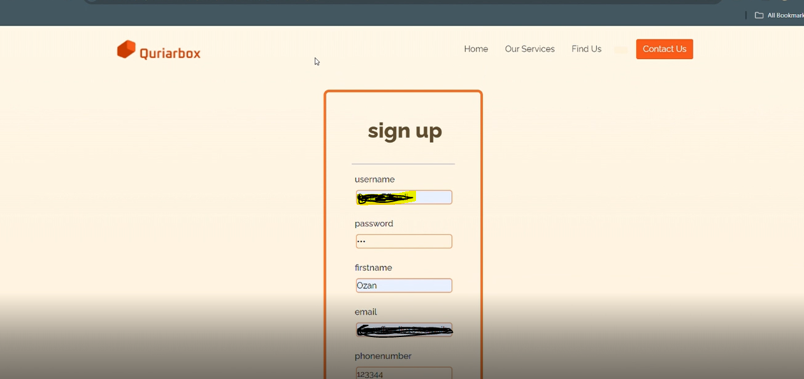
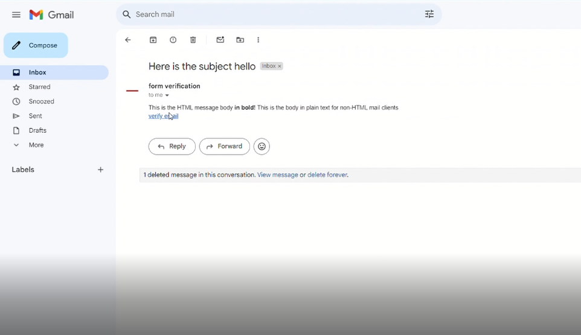
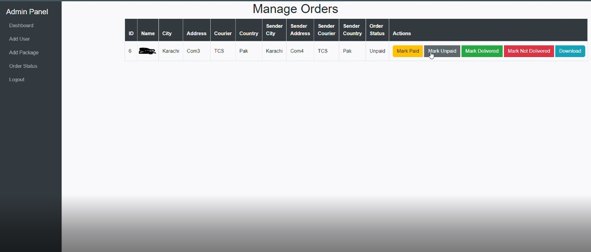

# Courier Web Application

## Project Description
**Courier Web Application** is a PHP-based platform that allows users to send couriers using various services. Users can sign up, verify their email, and log in to book courier services, track shipments, and manage orders through a simple interface. Admins have the ability to manage users and monitor shipments, providing an efficient courier solution.






## Key Features:
- **User Sign Up/Login**: Users can create an account, verify their email, and securely log in to their profiles.
- **Courier Booking**: Users can book courier services and manage their orders.
- **Shipment Tracking**: Users can track their shipments in real-time.
- **Admin Panel**: Admins can manage users and monitor shipments.
- **Mobile Responsive**: The platform is designed to be mobile-friendly for easy access.

## Features
- **User Authentication**: Secure login/signup functionality with email verification.
- **Courier Management**: Allows users to book and manage courier services.
- **Admin Dashboard**: Admins have a dashboard to manage users and monitor shipments.
- **Real-Time Tracking**: Users can track their shipments in real-time.
- **Mobile Responsive**: The platform is designed for mobile-friendly usage.

## Installation Instructions
To run this project locally on your machine, follow these steps:

1. Clone the repository:
   ```bash
   git clone https://github.com/SyedaFatimaZehra/courier.git
